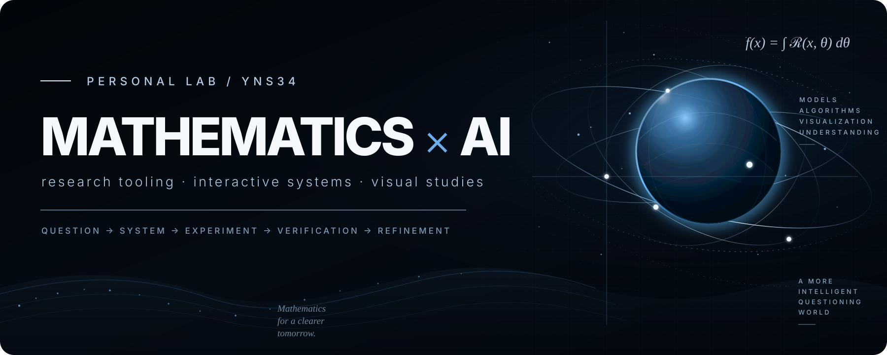

# YNS34

**Mathematics · AI-assisted research · interactive systems**

A working collection of mathematical research tools, AI-native experiments, and visual studies. The emphasis is on **clear problem framing, explicit verification, and deliberate interaction design** rather than a single technology stack.

---

### Research

**[Mathematics × AI for Research](https://github.com/YNS34-hub/YNS34-hub.github.io)**  
A long-term research space connecting nonlinear mathematics, AI-assisted scientific reasoning, and interactive visualization.

### Experiments

**[SCI-FI WEB WORKS](https://github.com/YNS34-hub/sci-fi-portfolio)**  
A ten-piece anthology of interactive web studies around memory, observation, time, atmosphere, and choice.

**[VOID//ECHO](https://github.com/YNS34-hub/void-echo)**  
A spatial-interface study built around real-time 3D scenes, shader-driven motion, and scroll-based narrative states.

**[Big Mouth Burger Intelligence](https://github.com/YNS34-hub/big-mouth-burger)**  
A fictional brand/interface study exploring editorial commerce, motion, and product presentation.

**[Giannis Editorial Fansite](https://github.com/YNS34-hub/giannis-fansite)**  
A sports-editorial visual study focused on long-form storytelling, responsive composition, and image-led presentation.

---

### Working principles

```text
question → system → experiment → verification → refinement
```

- Treat AI as an instrument, not an authority.
- Keep prototypes honest about their maturity and limitations.
- Prefer reproducible workflows over impressive-looking one-off demos.
- Separate original work, experiments, and external forks clearly.

<sub>Selected projects evolve over time; unfinished research systems stay private until they are ready to be evaluated.</sub>
